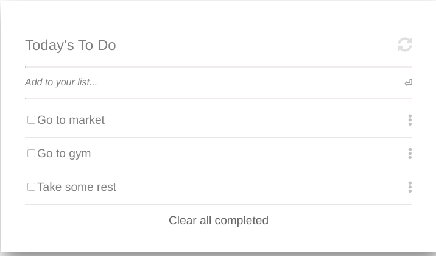

# Todo List

> Todo list is a webapp where user can maintain a list of their todos.

## Built With

- HTML
- JavaScript

## Live Demo (if available)

[Live Demo Link](https://chukwuebukaVictor.github.io/list-structure/)

## Getting Started

**Follow the steps below to run this project on you local machine**

To get a local copy up and running follow these simple example steps.

### Prerequisites
- Understanding of git and github
### Setup & Install
- Clone repo on your local device using `git clone <link>` command

## Authors

👤 **Chukwuebuka Victor Ozoede**

- GitHub: [@githubhandle](https://github.com/chukwuebukaVictor)
